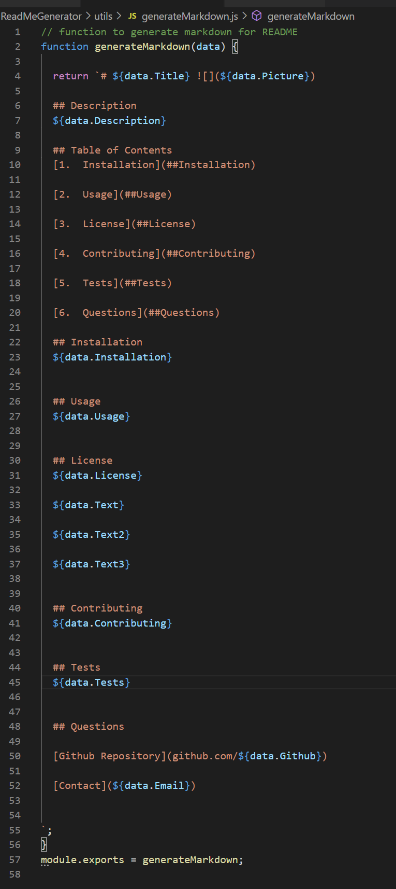

# Kurt's Project 

  ## Description 
  This is a sample auto-generated README Markdown file project.

  ## Table of Contents
  [1.  Installation](##Installation) 

  [2.  Usage](##Usage)

  [3.  License](##License)

  [4.  Contributing](##Contributing)

  [5.  Tests](##Tests)

  [6.  Code Snippets](##Snippets)

  [7.  Preview](##Preview)

  [8.  Questions](##Questions)

  ## Installation
  This needs node.js and inquirer packages.

  ## Usage
  Educational purposes only.

  ## License
  CC0-1.0

  The Creative Commons CC0 Public Domain Dedication waives copyright interest in a work you've created and dedicates it to the world-wide public domain. Use CC0 to opt out of copyright entirely and ensure your work has the widest reach. As with the Unlicense and typical software licenses, CC0 disclaims warranties. CC0 is very similar to the Unlicense.  Please see https://choosealicense.com/licenses/cc0-1.0/ for more information.

  

  

  ## Contributing
  No contribution guidelines at this time.

  ## Tests
  No test instructions necessary.

  ## Snippets

  Here are Code Snippets from the Javascript used.

  

  

  

  ## Preview
  
  Here is what the sample generated README document would look like.

  
  

  ## Questions

  [Github Repository](github.com/kurt-austin)

  [Contact](kurt.austin@gmail.com)

